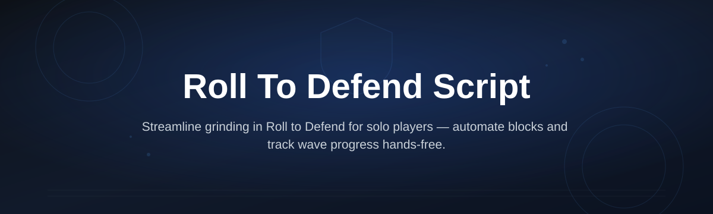
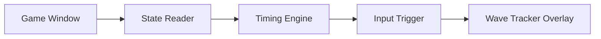

# roll-to-defend-script-hub

*A lightweight Roll to Defend Script hub built for players who'd rather practice timing than grind survival mode by hand.*

## What this is

roll-to-defend-script-hub is a Windows tool built around one game: Roll to Defend. If you've played it, you know the loop — waves of attacks come in, you roll to dodge, and one missed input can end a run you've been building for twenty minutes. This hub packages a set of helper scripts that read the game state and assist with defense timing, wave tracking, and repetitive setup tasks so you can focus on the parts of the game that are actually fun.

It started as a personal project. I was losing runs to input lag and boredom during the slow early waves, not to actual difficulty, so I wrote a script to handle the tedious part. Other players in the same Discord asked for it, so it became a proper hub with a settings panel instead of a single messy file. That's the whole origin story — no team, no roadmap deck, just a solo dev fixing an annoying problem and sharing the fix.

  

The button above opens the project's landing page, where the current build is available to download.

## Who it is for

| Audience | Why they use it |
|---|---|
| Solo Roll to Defend grinders | Automate the repetitive early waves without babysitting every roll |
| Players with high input latency | Get consistent dodge timing even on inconsistent connections |
| Speed/wave-clear players | Track wave counters and cooldowns without alt-tabbing to a spreadsheet |
| Roblox scripting hobbyists | Read a small, real codebase instead of a copy-pasted loader |
| Returning players | Reconfigure settings fast after a game update instead of relearning the UI |

## What you can do

| Capability | What it means in practice |
|---|---|
| **Auto-dodge timing** | Rolls trigger on incoming attack windows instead of relying on manual reflexes |
| **Wave tracker overlay** | See current wave, upcoming attack type, and cooldown timers on screen |
| **Configurable hotkeys** | Rebind every action so it fits your own keyboard layout |
| **Safe-mode toggle** | Instantly hand control back to you mid-run with one keypress |
| **Settings profiles** | Save separate configs for solo runs vs. group runs |
| **Lightweight footprint** | No background services, no persistent processes after you close it |
| **Update checker** | Warns you when the script is out of sync with a new game patch |
| **Session log** | Simple text log of wave results, useful for tracking your own progress |

## Getting started

1. Open the landing page using the download button on this page.
2. Download the current build (packaged as a single Windows executable).
3. Extract it to any folder — no installer, no admin rights needed.
4. Launch Roll to Defend, then run the tool and select your hotkeys.
5. Start a run; the overlay will confirm it's tracking the game window.

## Requirements

- Windows 10 or 11 (64-bit)
- Roll to Defend installed and updated to its current version
- No Python, Node, or other toolchain — it's a standalone executable
- A stable window title (don't rename the game window mid-run)

## How it works

The hub watches the game window, reads visible wave and timing cues, and turns those into scripted inputs at the right moment. It doesn't modify game files — it just automates the same button presses you'd otherwise make manually.

1. The state reader checks the game window for attack cues.
2. The timing engine calculates the dodge window.
3. The input trigger sends the roll command at the right frame.
4. The overlay updates your wave and cooldown display.
5. The session log records the outcome for that wave.

## FAQ

**Is this a Roll to Defend script or a full game mod?**
It's a script, not a mod. Nothing about the game's files or servers is changed — it automates inputs you could otherwise do yourself.

**Will this work after a Roll to Defend update?**
Usually, but timing-based reads can break when the game changes its attack animations. The update checker will tell you if a patch is needed.

**Does it work on Mac or Roblox mobile?**
No. This build targets Windows 10/11 desktop only, since Roblox mobile doesn't expose a comparable window to read.

**Can I use it for group or party runs?**
Yes — save a separate settings profile for group play, since attack timing differs slightly from solo runs.

**Why isn't this on the Roblox marketplace or a script store?**
It's a personal Windows tool, not a Roblox plugin, so it's distributed directly from the project landing page instead.

## Troubleshooting

- **Overlay shows no data:** Make sure Roll to Defend is the focused window and hasn't been renamed or resized unusually.
- **Timing feels off:** Check your in-game frame rate cap; very low or capped FPS throws off the timing engine's read.
- **Tool won't launch:** Confirm you extracted the full folder — running the executable from inside a zip archive will fail silently.
- **Hotkeys not responding:** Another background app may be capturing the same key combo; rebind to an unused key in settings.

## License

Released under the [MIT License](LICENSE). Use it at your own discretion; the author isn't responsible for account or gameplay outcomes from third-party game updates.

  

